# GovOS AI & EcoGov AI — Technical Architecture & Data Design (docs/04_technical_architecture.md)

This document contains the Technical Architecture and Data Design for **GovOS AI** and **EcoGov AI**.

---

## 1. Architectural Goals & Principles

### 1.1 Goals

- **Maintainable Monolith**: Restrict boundaries through directory isolation and strict dependency check rules, laying the path for future microservice extraction without early operational overhead.
- **Tenant Isolation**: Ensure that cross-tenant queries are blocked at both the database level (RLS) and application layer.
- **Auditability**: Record every AI agent decision, user action, and file modification on a secure, queryable ledger.
- **Configuration-Driven**: Build metadata structures using JSONB columns so that new facility types, inspection checklists, and policy rules can be deployed without updating application code.

### 1.2 Principles

1.  **Strict Bounded Contexts**: Code inside the `core` package must not depend on modules inside the `ecogov` package. `ecogov` modules may depend on `core` modules through explicit APIs.
2.  **Transactional Integrity**: Leverage PostgreSQL's ACID compliance. Use the Transactional Outbox pattern to emit events reliably.
3.  **Task Offloading**: Use non-blocking, asynchronous execution via Cloud Tasks. The main HTTP response loop must return quickly.

---

## 2. Architectural Diagrams

### 2.1 System Context Diagram

Shows the relationships between the users, the modular monolith, and external APIs.

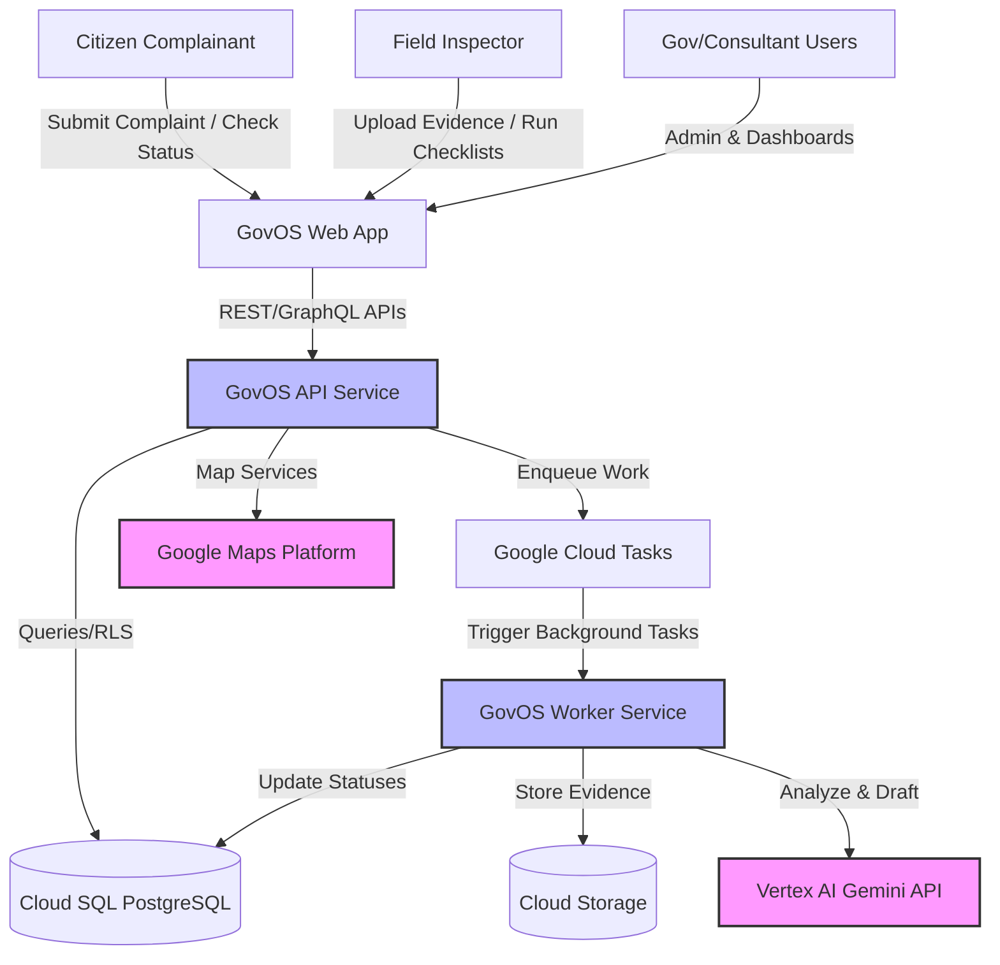

### 2.2 Container Diagram

Shows the deployable containers of the modular monolith.

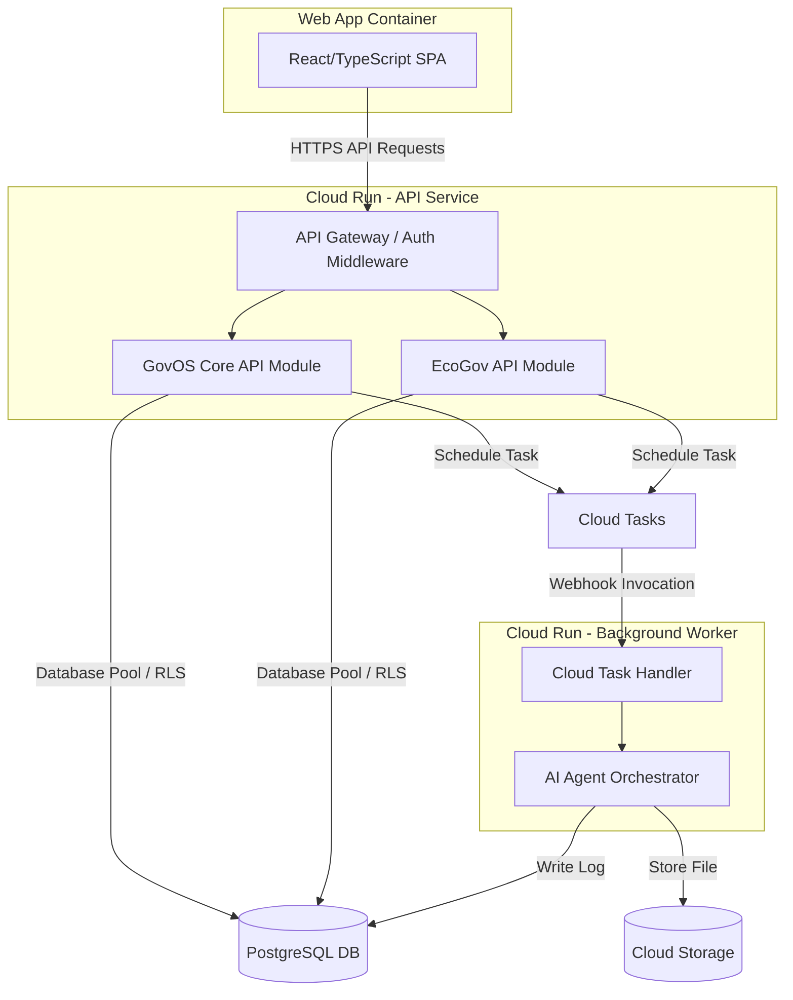

### 2.3 Modular Monolith Diagram

Shows Bounded Context dependencies. `ecogov` can call `core` but `core` must not import `ecogov`.

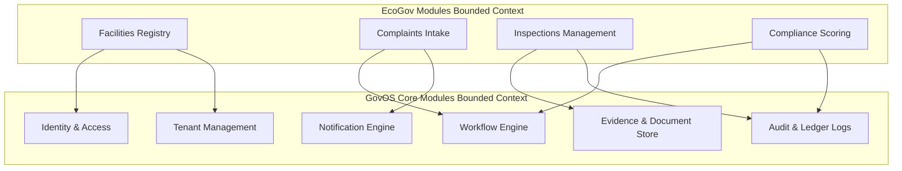

### 2.4 Complaint-to-Compliance Workflow

```mermaid
graph LR
    Complaint[Complaint Submitted] -->|AI Triage| Triaged[Triage Completed]
    Triaged -->|Director Approve| Case[Case Initialized]
    Case -->|Risk Analysis| Task[Inspection Planned]
    Task -->|Assign Route| Assigned[Inspector Scheduled]
    Assigned -->|Field Check| Completed[Inspection Completed]
    Completed -->|Evidence Upload| Evidence[Evidence Verified]
    Evidence -->|AI Draft Report| Report[Report Drafted]
    Report -->|Supervisor Sign| Signed[Report Signed]
    Signed -->|Compliance Suggestion| Notice[Remediation Notice Issued]
    Notice -->|Verify Uploads| Closed[Case Closed & Ledged]
```

### 2.5 Registration-Review Workflow

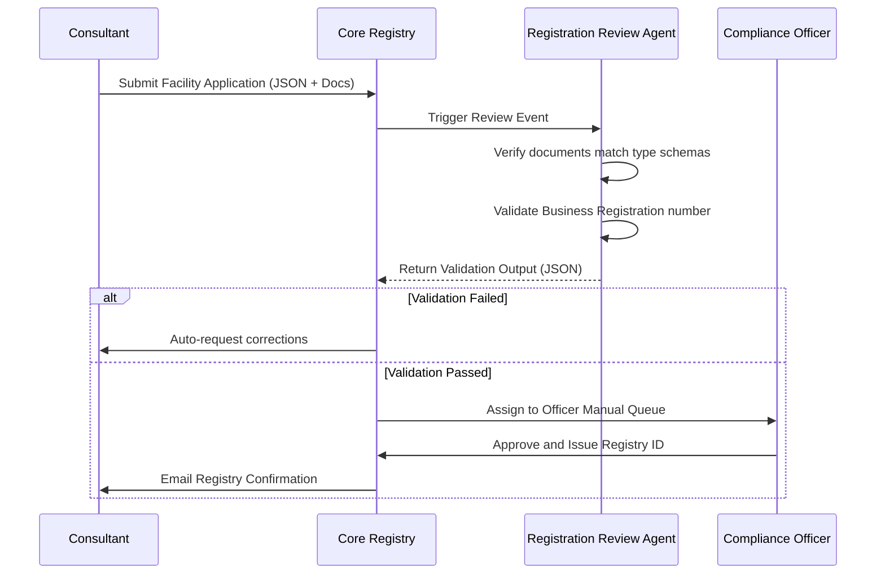

### 2.6 Inspection Lifecycle

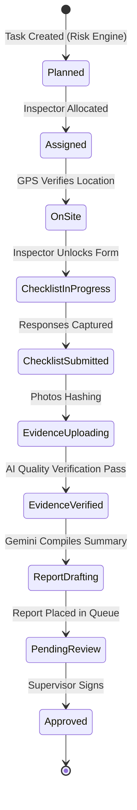

### 2.7 AI Evidence Analysis

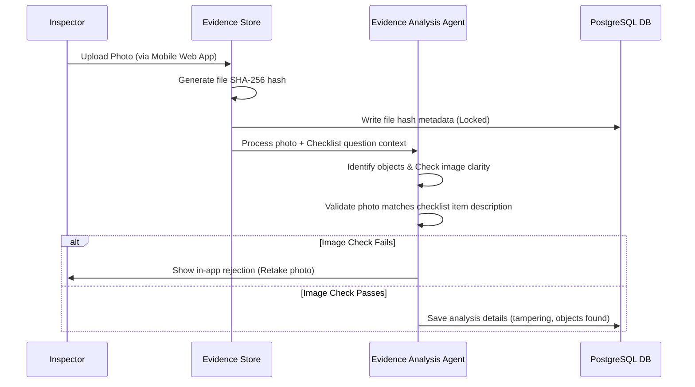

### 2.8 Report Approval

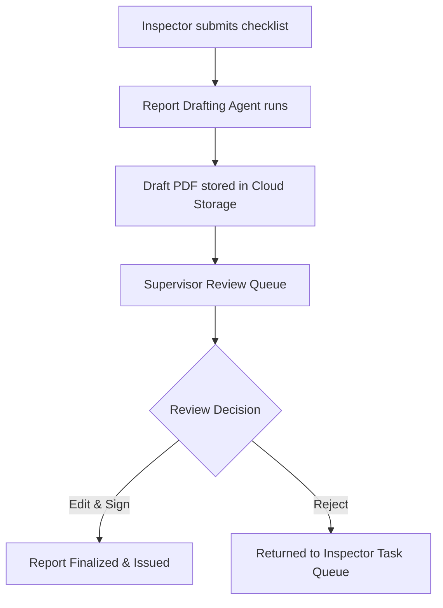

### 2.9 Compliance Approval

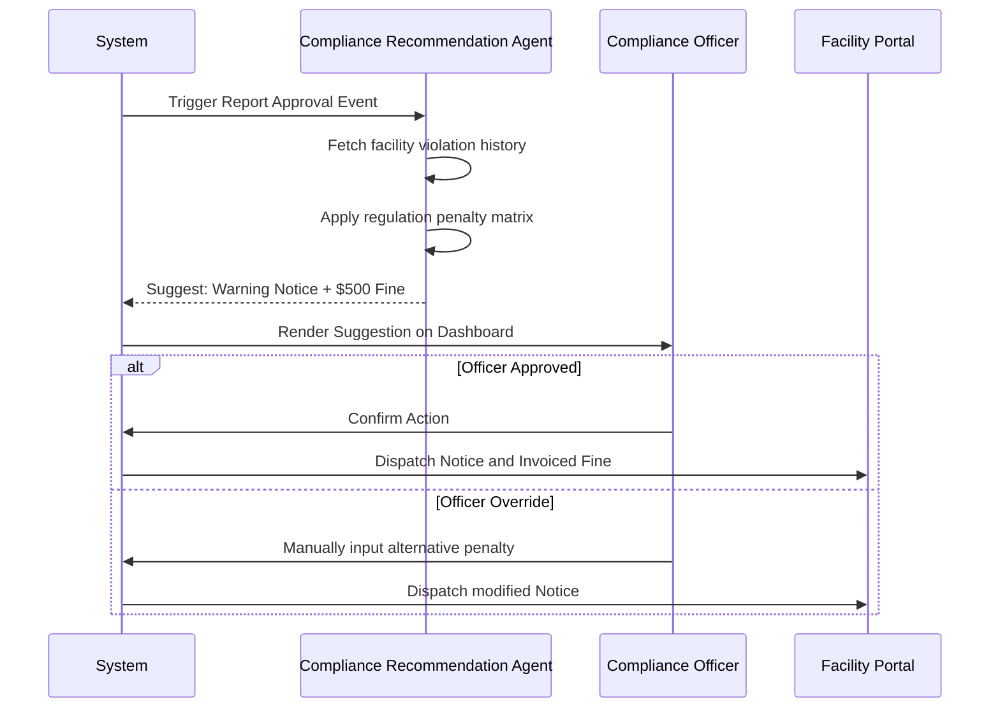

### 2.10 Agent Execution

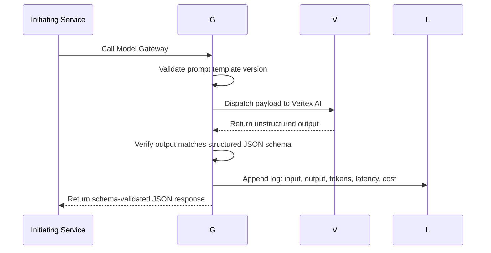

### 2.11 Asynchronous Job Processing

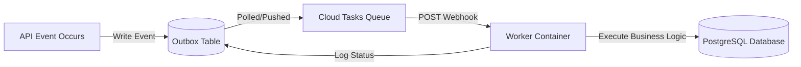

### 2.12 Tenant Onboarding

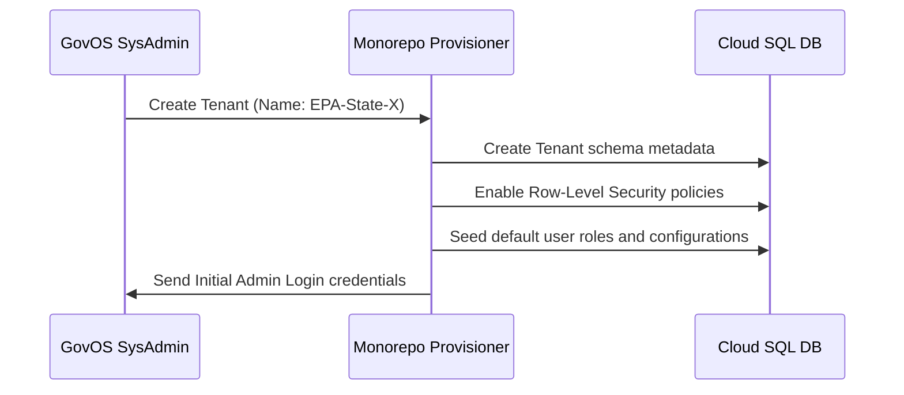

### 2.13 Evidence Upload

```mermaid
sequenceDiagram
    participant I as Inspector Mobile
    participant G as API Gateway
    participant C as GCS Storage
    participant D as PostgreSQL DB

    I->>I: Calculate file SHA-256 hash locally
    I->>G: Request signed upload URL (includes file hash)
    G->>D: Verify case ID exists; write metadata record
    G->>C: Request signed URL
    C-->>I: Return signed URL
    I->>C: Direct upload file chunks
    C->>D: Trigger upload confirmation hook
```

### 2.14 Executive Summary Generation

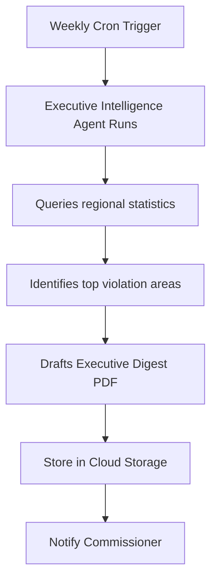

---

## 3. Data Design & Entity Schemas

We implement a multi-tenant shared database and schema configuration. All tables (except tenant config and global roles) include a `tenant_id` column. PostgreSQL Row-Level Security (RLS) policies are active on every table holding tenant data:
`CREATE POLICY tenant_isolation_policy ON target_table USING (tenant_id = current_setting('app.current_tenant_id'));`

### 3.1 Domain Model Entity Definitions

#### Core Platform Entities

##### `tenant`

- `id`: UUID (Primary Key)
- `name`: VARCHAR(255)
- `status`: VARCHAR(50) (Active/Suspended)
- `created_at`: TIMESTAMP WITH TIME ZONE
- `updated_at`: TIMESTAMP WITH TIME ZONE

##### `user_account`

- `id`: UUID (Primary Key)
- `tenant_id`: UUID (Foreign Key -> tenant.id)
- `email`: VARCHAR(255) (Unique)
- `password_hash`: VARCHAR(255)
- `status`: VARCHAR(50) (Active/Locked)
- `created_at`: TIMESTAMP WITH TIME ZONE
- `updated_at`: TIMESTAMP WITH TIME ZONE

##### `role`

- `id`: UUID (Primary Key)
- `tenant_id`: UUID (Foreign Key -> tenant.id)
- `name`: VARCHAR(100) (e.g., Inspector, Supervisor)
- `permissions`: JSONB (Array of string permissions)
- `created_at`: TIMESTAMP WITH TIME ZONE

##### `audit_event`

- `id`: UUID (Primary Key)
- `tenant_id`: UUID (Foreign Key -> tenant.id)
- `user_id`: UUID (Nullable, Foreign Key -> user_account.id)
- `action`: VARCHAR(100)
- `entity_name`: VARCHAR(100)
- `entity_id`: UUID
- `payload`: JSONB (Old vs New values)
- `client_ip`: VARCHAR(50)
- `created_at`: TIMESTAMP WITH TIME ZONE (Immutable)

##### `agent_execution` (AI Execution Ledger)

- `id`: UUID (Primary Key)
- `tenant_id`: UUID (Foreign Key -> tenant.id)
- `initiated_by`: UUID (Foreign Key -> user_account.id)
- `agent_name`: VARCHAR(100)
- `agent_version`: VARCHAR(50)
- `model_name`: VARCHAR(100)
- `prompt_template_version`: VARCHAR(50)
- `case_id`: UUID (Nullable)
- `input_payload`: JSONB
- `output_payload`: JSONB
- `latency_ms`: INTEGER
- `input_tokens`: INTEGER
- `output_tokens`: INTEGER
- `estimated_cost`: NUMERIC(10, 6)
- `human_reviewed`: BOOLEAN
- `human_override_reason`: TEXT
- `created_at`: TIMESTAMP WITH TIME ZONE (Immutable)

##### `outbox_event`

- `id`: UUID (Primary Key)
- `tenant_id`: UUID (Foreign Key -> tenant.id)
- `event_name`: VARCHAR(255)
- `payload`: JSONB
- `status`: VARCHAR(50) (Pending/Processed/Failed)
- `retry_count`: INTEGER
- `created_at`: TIMESTAMP WITH TIME ZONE

#### EcoGov Domain Entities

##### `facility`

- `id`: UUID (Primary Key)
- `tenant_id`: UUID (Foreign Key -> tenant.id)
- `name`: VARCHAR(255)
- `category`: VARCHAR(100) (e.g., Car Wash, Hotel)
- `address`: TEXT
- `geolocation`: POINT (GPS coordinate coordinates)
- `custom_fields`: JSONB (Dynamic fields configured per category)
- `compliance_score`: NUMERIC(5, 2)
- `created_at`: TIMESTAMP WITH TIME ZONE

##### `complaint`

- `id`: UUID (Primary Key)
- `tenant_id`: UUID (Foreign Key -> tenant.id)
- `complainant_name`: VARCHAR(255)
- `complainant_phone`: VARCHAR(50)
- `description`: TEXT
- `geolocation`: POINT
- `status`: VARCHAR(50) (Received/Triaged/Rejected/Converted)
- `triage_results`: JSONB (Result from Triage Agent)
- `created_at`: TIMESTAMP WITH TIME ZONE

##### `case_record` (Regulatory Case)

- `id`: UUID (Primary Key)
- `tenant_id`: UUID (Foreign Key -> tenant.id)
- `facility_id`: UUID (Foreign Key -> facility.id)
- `complaint_id`: UUID (Nullable, Foreign Key -> complaint.id)
- `status`: VARCHAR(50) (Initialized/Assigned/Inspected/Non-Compliant/Closed)
- `risk_priority`: VARCHAR(50) (High/Medium/Low)
- `created_at`: TIMESTAMP WITH TIME ZONE

##### `inspection_task`

- `id`: UUID (Primary Key)
- `tenant_id`: UUID (Foreign Key -> tenant.id)
- `case_id`: UUID (Foreign Key -> case_record.id)
- `assigned_inspector_id`: UUID (Foreign Key -> user_account.id)
- `status`: VARCHAR(50) (Scheduled/InProgress/Submitted/Approved)
- `checklist_responses`: JSONB (Question/Answer values)
- `scheduled_date`: DATE
- `created_at`: TIMESTAMP WITH TIME ZONE

##### `evidence_file`

- `id`: UUID (Primary Key)
- `tenant_id`: UUID (Foreign Key -> tenant.id)
- `inspection_id`: UUID (Foreign Key -> inspection_task.id)
- `file_url`: TEXT
- `file_hash`: CHAR(64) (SHA-256 checksum)
- `gps_timestamp`: TIMESTAMP WITH TIME ZONE
- `gps_coordinates`: POINT
- `analysis_results`: JSONB (Agent validation metadata)
- `created_at`: TIMESTAMP WITH TIME ZONE (Immutable)

##### `compliance_action`

- `id`: UUID (Primary Key)
- `tenant_id`: UUID (Foreign Key -> tenant.id)
- `case_id`: UUID (Foreign Key -> case_record.id)
- `type`: VARCHAR(100) (e.g., Warning Notice, Fine Invoice)
- `status`: VARCHAR(50) (Issued/Remediated/Escalated)
- `fine_amount`: NUMERIC(12, 2)
- `remediation_deadline`: DATE
- `remediation_proof_url`: TEXT
- `created_at`: TIMESTAMP WITH TIME ZONE

---

## 4. Domain Event Catalogue

Every event generated inside the modular monolith is stored in the `outbox_event` table before dispatch.

| Event Name               | Producer Module | Consumer Modules             | Payload Schema                                                         | Retry Policy                   | Retention Policy   |
| :----------------------- | :-------------- | :--------------------------- | :--------------------------------------------------------------------- | :----------------------------- | :----------------- |
| `ComplaintSubmitted`     | complaints      | AI Operations, Notifications | `{ "complaint_id": "UUID", "category": "string", "source": "public" }` | 5 retries, exponential backoff | 30 days            |
| `ComplaintTriaged`       | AI Operations   | Cases, Notifications         | `{ "complaint_id": "UUID", "urgency": 3.5, "duplicate": false }`       | 3 retries, linear              | 30 days            |
| `CaseInitialized`        | case_record     | Inspections, Audit           | `{ "case_id": "UUID", "facility_id": "UUID", "risk": "High" }`         | 5 retries, exponential         | Indefinite (Audit) |
| `InspectionSubmitted`    | inspections     | AI Operations, Audit         | `{ "inspection_id": "UUID", "inspector_id": "UUID" }`                  | 5 retries                      | Indefinite         |
| `EvidenceUploaded`       | evidence_file   | AI Operations                | `{ "file_id": "UUID", "file_hash": "string", "path": "string" }`       | 3 retries                      | Indefinite         |
| `ReportApproved`         | inspections     | Compliance, Notifications    | `{ "inspection_id": "UUID", "supervisor_id": "UUID" }`                 | 5 retries                      | Indefinite         |
| `ComplianceActionIssued` | compliance      | Notifications                | `{ "action_id": "UUID", "fine": 500.00, "deadline": "2026-08-05" }`    | 5 retries                      | Indefinite         |
| `CaseClosed`             | case_record     | Audit, Reporting             | `{ "case_id": "UUID", "resolution": "Remediated" }`                    | 5 retries                      | Indefinite         |
| `AgentExecutionLogged`   | AI Operations   | Audit                        | `{ "execution_id": "UUID", "cost": 0.0125 }`                           | 3 retries                      | Indefinite         |
