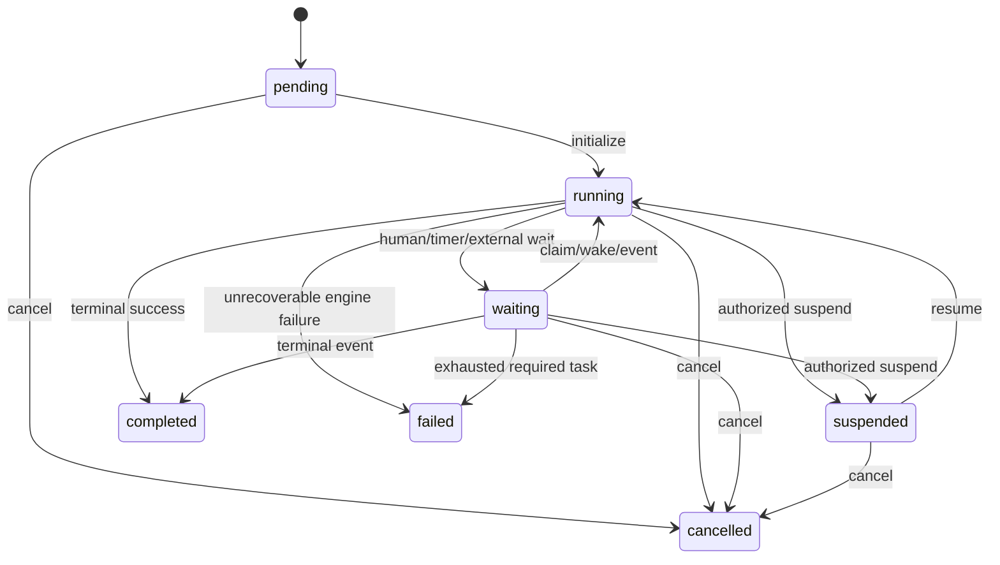

# WF-1 State Machine Model

## Definition lifecycle

`draft -> validating -> draft` on validation failure; `validating -> published` on success and authorized publish; `published -> deprecated`; draft may be withdrawn. Published/deprecated content is immutable. A definition can choose one published default for new starts.

## Instance lifecycle

Terminal states are `completed|cancelled|failed`. A terminal instance cannot resume or transition; repair creates a governed retry/compensation command or a new instance, never rewrites history.

## Step execution lifecycle

`created -> ready`; human: `ready -> claimed -> running -> completed|failed`; machine: `ready -> running -> completed|failed`; wait: `ready -> waiting -> completed`; retryable failure: `running -> ready` with a new attempt and bounded counter; exhausted: `failed -> dead_lettered`; cancellation from nonterminal states. `skipped` is terminal and only engine-produced by a deterministic branch.

## Transition semantics

One command locks/CAS-checks instance and current step, validates one deterministic matching transition, completes the current execution, creates successor execution(s), updates instance state/version, appends ordered events, initializes assignment/SLA/timer records, and enqueues work atomically. Same command replay returns the recorded response. Same key/different request hash returns 409.

Parallelism is not enabled in the first runtime release. The schema may support tokens later, but WF-1 initially guarantees one active logical step per instance. Cycles require an explicit bounded loop policy; otherwise publication rejects cycles.

## Condition model

Typed JSON AST operators: boolean `all/any/not`; equality/ordering; set membership; existence; bounded string/date/number comparisons. Inputs are immutable step output references plus allowlisted instance context. No network, clock, randomness, regex backtracking, dynamic property traversal, or arbitrary expression language. Evaluation result and policy/schema version are audited.

## Invariants

Pinned version never changes; sequence/version strictly increases; at most one current step/work item/timer per configured path; a step completes once; terminal timestamps align with state; successor belongs to pinned version; terminal steps have no outgoing transitions; every nonterminal reaches a terminal under publication analysis.
