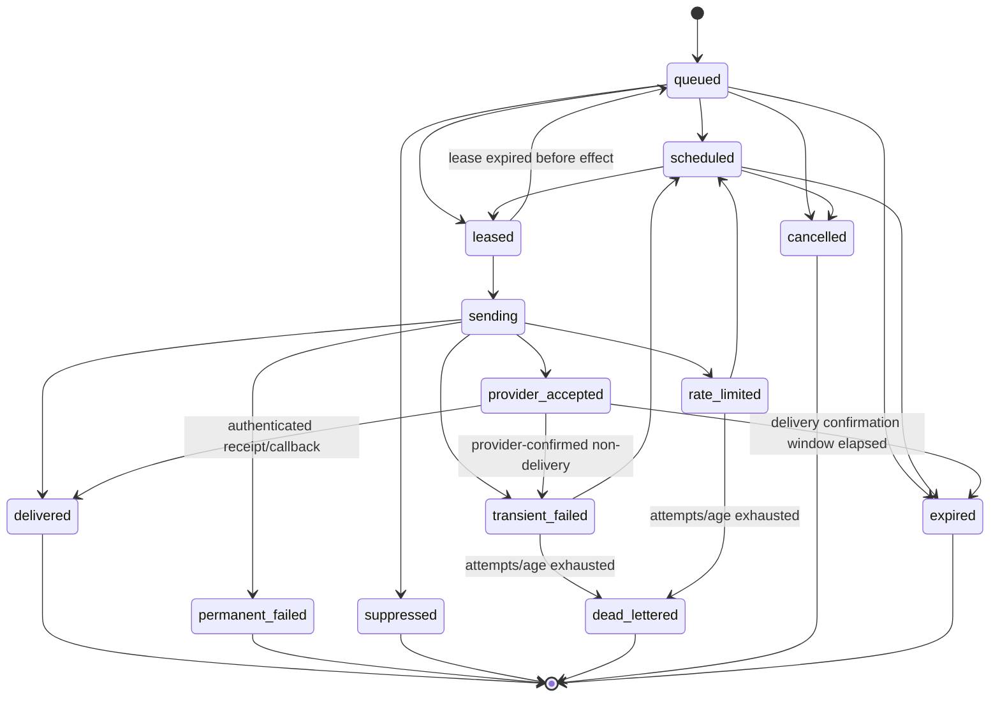

# WF-2 Delivery State Machine

Status: Proposed for independent review

## Request aggregate states

Exact vocabulary:

`accepted`, `resolving`, `scheduled`, `processing`, `partially_delivered`, `delivered`, `suppressed`, `failed`, `dead_lettered`, `cancelled`, `expired`.

| From                  | Permitted transition                                                                                              |
| --------------------- | ----------------------------------------------------------------------------------------------------------------- |
| creation              | `accepted`                                                                                                        |
| `accepted`            | `resolving`, `cancelled`, `expired`                                                                               |
| `resolving`           | `scheduled`, `processing`, `suppressed`, `failed`, `dead_lettered`, `cancelled`, `expired`                        |
| `scheduled`           | `processing`, `cancelled`, `expired`                                                                              |
| `processing`          | `processing`, `partially_delivered`, `delivered`, `suppressed`, `failed`, `dead_lettered`, `cancelled`, `expired` |
| `partially_delivered` | `processing`, `delivered`, `failed`, `dead_lettered`, `cancelled`, `expired`                                      |

All other transitions are rejected. Terminal states are `delivered`, `suppressed`, `failed`, `dead_lettered`, `cancelled`, and `expired`. A terminal state cannot be reopened; an authorized replay creates a new request linked to the old request.

Request aggregation is deterministic:

- all child deliveries delivered/accepted under channel policy -> `delivered`;
- a mix of successful and non-successful terminal children -> `partially_delivered` while retryable children remain, otherwise `failed` or `dead_lettered` according to terminal children;
- all children suppressed -> `suppressed`;
- any retryable child -> `processing` or `scheduled`;
- all failed and at least one exhausted -> `dead_lettered`;
- expiry before required success -> `expired`.

## Channel delivery states

Exact vocabulary:

`queued`, `scheduled`, `leased`, `sending`, `provider_accepted`, `delivered`, `transient_failed`, `rate_limited`, `permanent_failed`, `suppressed`, `dead_lettered`, `cancelled`, `expired`.

`provider_accepted` means the provider accepted responsibility; it is not proof of human receipt. Email/SMS routes may define accepted as the success criterion while retaining later bounce/delivery callbacks. In-app creation moves directly to `delivered`. Webhook 2xx moves directly to `delivered`.

## Attempt states and classifications

Attempt states are `started`, `succeeded`, `transient_failed`, `rate_limited`, `permanent_failed`, and `lease_lost`. `suppressed` is decided before provider invocation and creates no provider attempt. Every attempt has one terminal attempt state.

Failure classifications are exact:

- `transient`: network failure, timeout before known acceptance, provider 5xx, temporary dependency outage;
- `permanent`: invalid/undeliverable destination, provider 4xx other than 408/409/425/429 when contract says permanent, unsupported content, revoked endpoint;
- `suppressed`: preference/policy/suppression/quiet-hours terminal decision where no later schedule applies;
- `rate_limited`: local or provider quota with bounded retry time;
- `unknown`: external acceptance cannot be proven or disproven; reconcile when supported, otherwise dead-letter without automatic failover;
- `dead_lettered`: retry/age budget exhausted, unknown outcome requiring operator decision, missing provider/secret/template, or invariant failure.

## Concurrency and history

- Every mutable transition compares `version`, current state, tenant, lease owner, fencing token, and unexpired lease where applicable.
- Provider callbacks lock the delivery and use callback dedupe before advancing state.
- Stale workers and stale callbacks append a denied/superseded audit result but cannot alter current state.
- Every accepted transition appends `notification_delivery_status_history` in the same transaction with the next per-request sequence.
- Cancellation is best effort after provider invocation; it never rewrites a provider-accepted or delivered child as cancelled.
