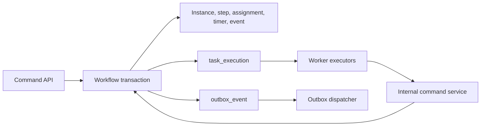

# ADR-004: Enterprise Workflow Engine

- Status: Accepted
- Milestone: WF-1
- Decision owners: GovOS architecture and security reviewers
- Implementation status: Not started

## Context

GovOS already has tenant-isolated workflow definitions, immutable version references on instances, step definitions, transitions, runtime instances, step executions, workflow audit, a graph validator, durable `task_execution` leases, and a transactional outbox. Facility registration, complaints, AI screening, notifications, and licensing use parts of this foundation. The current runtime is intentionally small: one pending step is transitioned synchronously, conditions are not evaluated by a governed engine, assignments and timers are implicit, runtime rows have no version/CAS field, and SLA/escalation semantics are absent.

WF-1 must become a reusable enterprise orchestration substrate without breaking existing workflows or turning the browser into an execution authority.

## Decision

1. Evolve the existing PostgreSQL-backed engine additively. Do not introduce a second workflow store or external orchestrator in WF-1.
2. PostgreSQL is the authoritative state store. Every command executes in one transaction, locks/CAS-checks its aggregate, appends an immutable event, and enqueues required work through `task_execution` or `outbox_event`.
3. A workflow instance remains permanently pinned to the published version with which it started. Published versions are immutable; changes require a new draft version.
4. Runtime changes are command-driven. API routes authorize and validate commands but never execute business tasks inline.
5. Human work uses explicit assignment and claim records. Machine work uses durable leased tasks with heartbeats, bounded retries, deterministic idempotency keys, dead-letter state, and replay controls.
6. SLA clocks are persisted, calendar-aware, pauseable only by policy, and evaluated asynchronously. Escalations are idempotent policy actions, never hidden timer callbacks.
7. Tenant isolation is enforced in every primary/composite foreign key and query. Organization scope is enforced for delegated actors. Platform administration remains separate.
8. Workflow audit is append-only, ID-only/redacted, ordered per instance, and records accepted and denied commands.
9. Existing workflow APIs/services remain supported during a compatibility phase. New engine paths use exact permissions and never `user:write`, wildcard, or `platform.*` authorization.

## State ownership

## Alternatives rejected

- External BPM/orchestration platform now: adds dual control planes, tenant/security integration, and operational burden before GovOS contracts stabilize.
- Event sourcing as the only state store: unnecessary migration and projection risk; WF-1 uses append-only events plus transactional current state.
- Mutable active definitions: destroys reproducibility and safe in-flight execution.
- Synchronous route execution: violates retry, recovery, and licence/payment architecture constraints.
- One generic JSON workflow table: weak referential integrity and poor operational querying.

## Consequences

Positive: deterministic recovery, auditable decisions, safe retries, version reproducibility, reusable human/machine work, and measurable SLAs. Costs: additive schema, stricter publication validation, scheduler/worker operations, more explicit commands, and a compatibility adapter until legacy callers migrate.

## Review gates

ADR acceptance is required before migration drafting. Database/API/security review precedes implementation. Migration apply, engine activation, and legacy-adapter retirement are separate approvals. No existing workflow is migrated in place without a workflow-specific equivalence test and owner approval.
